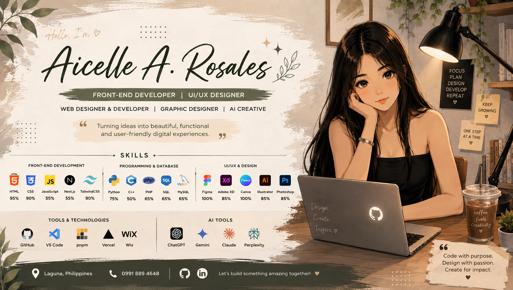
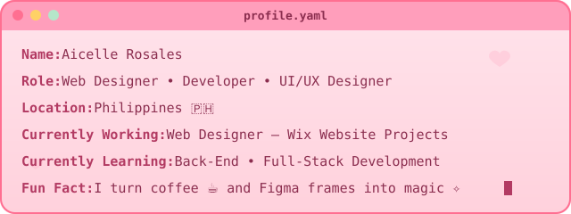
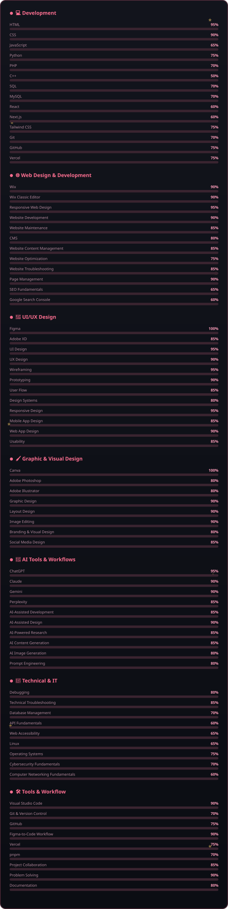
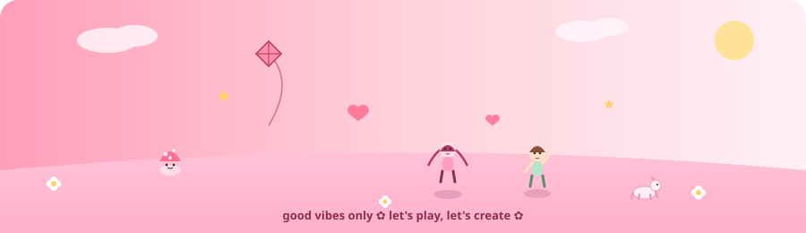

 

 

 

 

## 🌷 About Me

I'm a Web Designer, Developer, and UI/UX Designer focused on creating responsive, visually engaging, and user-centered digital experiences. I combine design, development, and problem-solving to turn ideas into polished websites and functional web applications.

I currently work on Wix website projects for clients, while continuously building my skills in modern web development, UI/UX, and full-stack technologies. I enjoy transforming designs into responsive interfaces, improving user experiences, and finding practical solutions to technical and design Challenges.

Tech & Tools:
HTML • CSS • JavaScript • PHP • Python • SQL • MySQL • React • Next.js • Tailwind CSS • Wix • Figma • Adobe XD • Photoshop • Illustrator • Canva • Git • GitHub • Vercel

I'm currently expanding my knowledge in React, Next.js, APIs, databases, backend development, full-stack applications, website optimization, and modern web technologies while exploring how AI-powered tools can improve both development and creative workflows. 🌻

> *"Design is not just what it looks like and feels like. Design is how it works."* — Steve Jobs

## 🌼 What I Do

<table>
<tr>
<td width="50%" valign="top">

**🌐 Web Development**

Develop responsive, fast, and clean websites using modern technologies.

**✧ UI/UX Design**

Design intuitive and visually appealing interfaces for great user experiences.

</td>
<td width="50%" valign="top">

**▣ Wireframing & Prototyping**

Build interactive wireframes and prototypes to visualize ideas and test user flows.

**◫ Design Systems**

Create consistent and scalable design systems for cohesive digital products.

</td>
</tr>
</table>

## 🧺 Skills & Tools

**Front-End Development**

  

**UI/UX & Design**

  

**Tools & Technologies**

  

**AI Tools**

  

  

## 🍂 Experience

<b>🌾 Web Designer & Developer — Malama Co.</b> (Jul 2026 – Present)

*Part-time · Remote · Australia*

Manage and maintain Wix websites for Australian clients, build service landing pages, and implement Wix CMS features, dynamic pages, and collections.

`Wix` `Responsive Design` `Web Development` `UI/UX Design` `CMS`

<b>🌸 Quality Assurance Tester — Assemble</b> (Jul 2026 – Aug 2026)

*Part-time · Remote*

Tested websites and applications to identify bugs, usability issues, and inconsistencies. Created detailed bug reports with clear reproduction steps and expected versus actual results. Performed functional, UI, and regression testing to help ensure quality, reliability, and a smooth user experience. Collaborated with the team to verify fixes and improve overall product quality.

`Quality Assurance` `Manual Testing` `Functional Testing` `Test Case Creation`

<b>🌻 AI Training Data Contributor — Outlier</b> (May 2026 – Jul 2026)

*Part-time · Remote*

Contributed high-quality voice and video datasets used for AI model training and evaluation.

`AI Training` `Data Collection` `Data Validation` `Quality Assurance`

<b>🌸 Front-End Developer / IT Technical Support — Torres Technology Center Corp.</b> (Feb 2026 – May 2026)

*Internship · On-site*

Developed and maintained responsive web apps using HTML, CSS, and JavaScript; provided technical support and system troubleshooting.

`HTML` `CSS` `JavaScript` `Technical Support` `IT Operations`

<b>🍯 Data Annotator / Data Labelling — CrowdGen Pro</b> (Sep 2025 – Nov 2025)

*Part-time · Remote*

Annotated and reviewed datasets for AI model training with a focus on accuracy and quality control.

`Data Annotation` `Data Labeling` `AI Data` `Quality Control`

## 🚀 Featured Projects

| Project | Type | Description |
|---|:---:|---|
| 🔎 [**Onlook**](https://onlook-livid.vercel.app/) *(Thesis)* |  Web | Collaborative system to monitor, report, and assist missing and cognitively impaired individuals |
| 🏦 [**Bank System**](https://www.figma.com//8QRjN35QVqnhSKuUdcRgpn/BANK-SYSTEM) |  System | Secure banking app with transfers, balance tracking, and reporting |
| 🔄 [**Converter System**](https://www.figma.com/design/HTviG6YNluJ5W8Uc1N5QxL/CONVERTER-SYSTEM) |  System | Real-time currency and unit converter with a clean UX |
| 🛒 [**Freshly Dropped**](https://www.figma.com/design/RJqXQCecjVqomkvtOgvUfx/Freshly-Dropped) |  Mobile | Food delivery & marketplace platform |
| 🎬 [**FilmTrack**](https://www.figma.com/design/bLes37eN9u3aa13n4X2n4b/FILMTRACK-WEBSITE-PHP) |  Web | Movie tracking platform with watchlists and reviews |
| 💚 [**LifeHaven**](https://www.figma.com/design/lcpe4JHUmionm4yfgHjnZ0/LIFEHAVEN-IOS-APP) |  Mobile | Health & wellness app with fitness tracking and personalized goals |

 

 

🌼 **20+ projects done** across web, mobile, and system design — see the full collection on my [portfolio](https://v0-personal-website-build-dusky.vercel.app).

## 🎓 Certifications

| | |
|---|---|
| 🛡️ Introduction to Cybersecurity | *Cisco Networking Academy* |
| 🖥️ Operating Systems Basics | *Cisco Networking Academy* |
| 🐧 Linux Essentials | *Cisco Networking Academy* |
| 🔐 IT Specialist – Cybersecurity | *Pearson* |

## 💼 Professional Focus

<table align="center">
<tr>
<td width="50%" valign="top">

- 🌐 Web Design & Development
- 🎨 UI/UX Design & Prototyping
- 🖥️ Front-End Development
- 📱 Responsive Web & Mobile Design
- 🧩 Website Development & Optimization
- 🛠️ Website Maintenance & Technical Improvements
- 🔗 Link & Navigation Fixes
- 📐 Responsive Layout & Cross-Browser Design
- ⚡ Website Performance & Usability Improvements

</td>
<td width="50%" valign="top">

- 🧠 User-Centered Design & Problem Solving
- 🤖 AI-Assisted Creative & Development Workflows
- 🎨 Graphic Design & Digital Content Creation
- 📊 Quality Assurance & Visual Review
- 🔍 Research, Testing & Troubleshooting
- 🧹 Website Content Organization & Cleanup
- 🗂️ CMS & Website Content Management
- 🚀 Continuous Learning & Skill Development

</td>
</tr>
</table>

## 🌱 Currently Growing In

🔹 Advanced Front-End Development&nbsp;&nbsp;•&nbsp;&nbsp;🔹 Back-End Development&nbsp;&nbsp;•&nbsp;&nbsp;🔹 Full-Stack Web Applications
🔹 Modern JavaScript Frameworks&nbsp;&nbsp;•&nbsp;&nbsp;🔹 API Integration&nbsp;&nbsp;•&nbsp;&nbsp;🔹 Database Management
🔹 Web Accessibility & Usability&nbsp;&nbsp;•&nbsp;&nbsp;🔹 Website Performance Optimization
🔹 AI-Assisted Development&nbsp;&nbsp;•&nbsp;&nbsp;🔹 Scalable Web & Mobile Applications

 

## 💡 What I Bring

<table align="center">
<tr>
<td width="50%" valign="top">

- ✨ Creative problem-solving
- 🎯 Attention to detail
- 🧠 User-focused thinking
- 🔧 Technical troubleshooting

</td>
<td width="50%" valign="top">

- 🎨 Strong visual design sense
- 📚 Fast learning & adaptability
- 🤝 Collaboration on real-world projects
- 🚀 Passion for building practical digital solutions

</td>
</tr>
</table>

## 🌻 GitHub Stats

  

 

 
<strong>Thanks for visiting my little corner of GitHub 🌾🍄</strong>

